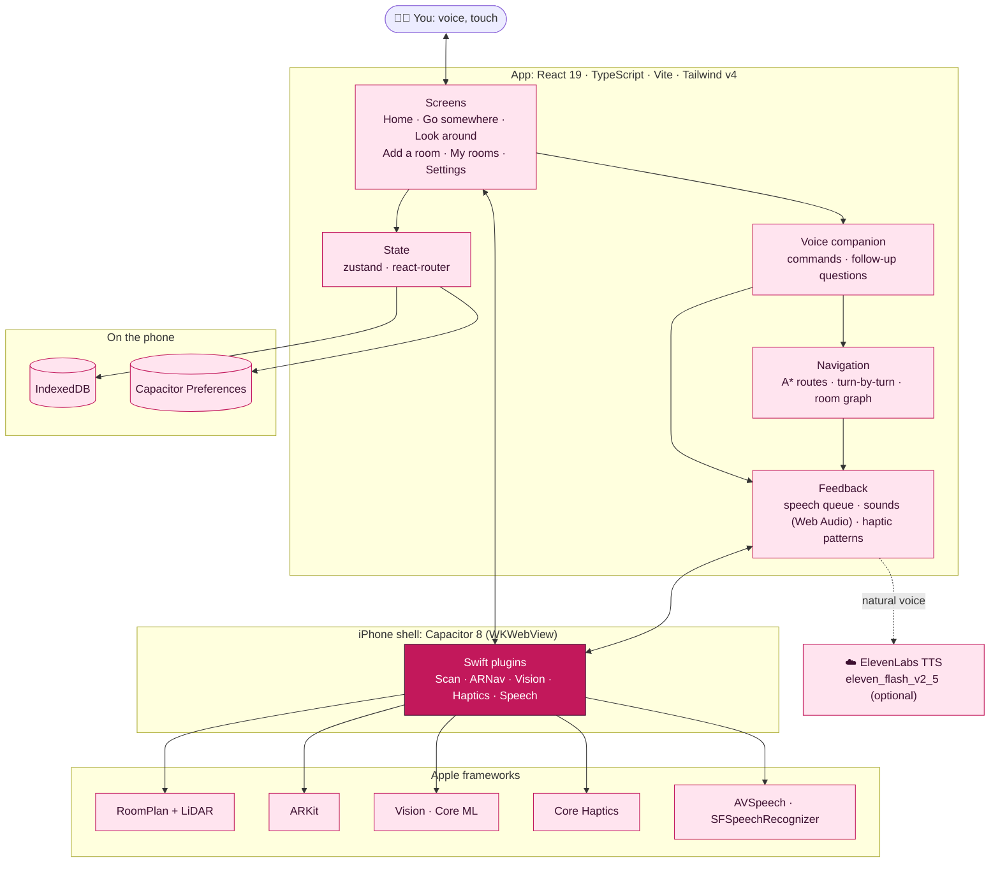

# Tech stack

```mermaid
flowchart TB
  user(["🧑‍🦯 You: voice, touch"])

  subgraph web["App: React 19 · TypeScript · Vite · Tailwind v4"]
    screens["Screens<br/>Home · Go somewhere · Look around<br/>Add a room · My rooms · Settings"]
    companion["Voice companion<br/>commands · follow-up questions"]
    nav["Navigation<br/>A* routes · turn-by-turn · room graph"]
    state["State<br/>zustand · react-router"]
    feedback["Feedback<br/>speech queue · sounds (Web Audio) · haptic patterns"]
  end

  subgraph shell["iPhone shell: Capacitor 8 (WKWebView)"]
    plugins["Swift plugins<br/>Scan · ARNav · Vision · Haptics · Speech"]
  end

  subgraph apple["Apple frameworks"]
    roomplan["RoomPlan + LiDAR"]
    arkit["ARKit"]
    vision["Vision · Core ML"]
    haptics["Core Haptics"]
    speech["AVSpeech · SFSpeechRecognizer"]
  end

  subgraph store["On the phone"]
    idb[("IndexedDB")]
    prefs[("Capacitor Preferences")]
  end

  eleven["☁️ ElevenLabs TTS<br/>eleven_flash_v2_5 (optional)"]

  user <--> screens
  screens --> companion --> nav
  screens --> state
  companion --> feedback
  nav --> feedback
  screens <--> plugins
  feedback <--> plugins
  plugins --> roomplan & arkit & vision & haptics & speech
  state --> idb & prefs
  feedback -. natural voice .-> eleven

  classDef pink fill:#ffe4ef,stroke:#c2185b,color:#3d1030
  classDef deep fill:#c2185b,stroke:#3d1030,color:#ffffff
  class screens,companion,nav,state,feedback pink
  class plugins deep
  class roomplan,arkit,vision,haptics,speech,idb,prefs,eleven pink
```

**Tooling:** Vitest · Testing Library · ESLint · Prettier · GitHub Actions (CI, including an Xcode build) · Xcode 16
